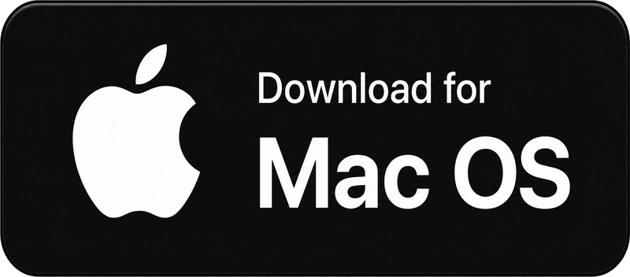

<p align="center">
    
</p>

<h1 align="center">
  Mac Whisper
</h1>

<p align="center">
  <em>Hold <strong>Fn</strong> to talk. A macOS menu-bar app that turns your voice into text,
  anywhere your cursor is — with optional LLM refinement.</em>
</p>

<p align="center">
  
  
  <a href="./LICENSE"></a>
</p>

<p align="center">
  <a href="https://github.com/bytonylee/mac-whisper/releases/latest/download/MacWhisper.dmg"></a>
</p>

---

<p align="center">
  
</p>

## What it is

Mac Whisper is a push-to-talk dictation app that lives in your menu bar. Hold the **Fn / Globe** key, speak, and release — your words are typed into whatever field currently has focus. A floating Liquid Glass HUD shows the live transcript and a waveform while you talk. An optional LLM post-processing step cleans up obvious speech-recognition errors before the text is injected.

- **Push-to-talk via Fn/Globe** — read directly from the keyboard HID, no hotkey conflicts.
- **Live floating HUD** — capsule-shaped, Liquid Glass on macOS 26, frosted HUD material below. Never steals focus.
- **5 languages** — English, Korean, Simplified Chinese, Traditional Chinese, Japanese.
- **On-device recognition** when supported (privacy + responsiveness).
- **Optional LLM refinement** — OpenAI-compatible or Anthropic-compatible endpoints. Conservative, language-neutral post-editor.
- **Smart audio routing** — forces the built-in mic so a Bluetooth headset stays in high-quality A2DP, and mutes system output while dictating.
- **Silence auto-stop** — ends the session after sustained silence so you don't have to hold Fn forever.

## Requirements

- macOS 26 (Tahoe) or newer. `NSGlassEffectView` (Liquid Glass) only renders the real frosted material at a 26+ deployment target; older systems fall back to a flat translucent appearance.
- Xcode Command Line Tools (`swift` / `swiftc`).
- Permissions: **Microphone**, **Speech Recognition**, **Input Monitoring** (to read the Fn key), **Accessibility** (to inject text).

## Install

### From source (recommended for now)

```bash
git clone <your-repo-url> mac-whisper
cd mac-whisper
make app        # builds and codesigns MacWhisper.app
open MacWhisper.app
```

For persistent permissions across rebuilds, create a stable self-signed identity once:

```bash
make cert       # one-time; lets TCC permissions survive rebuilds
make app
```

Without `make cert`, the app is ad-hoc signed and macOS resets Input Monitoring / Accessibility permissions on every rebuild.

### Install to /Applications

```bash
make install
```

## Build & run

```bash
make run        # builds, codesigns, and launches; sources .env if present
make build      # swift build only
make dmg        # create build/MacWhisper.dmg
make clean      # remove .build and MacWhisper.app
```

## Usage

1. Launch Mac Whisper. A microphone icon appears in the menu bar.
2. Grant the four permissions from the **Permissions…** window (status updates automatically).
3. Put your cursor in any text field.
4. **Hold Fn**, speak, **release Fn**. The transcript is typed at the cursor.

### Menu bar

| Menu item | Action |
| --- | --- |
| **Language** | Switch recognition language (en / ko / zh-Hans / zh-Hant / ja). |
| **LLM Refinement → Enable** | Toggle LLM post-processing. Opens Settings if not configured. |
| **LLM Refinement → Settings…** | Configure provider, model, base URL, API key. |
| **Auto-stop on Silence** | End the session after ~2.5 s of silence once you've spoken. |
| **Permissions…** | Open the combined permissions window. |
| **Quit** | ⌘Q |

## LLM refinement configuration

The API key is read from the environment, never stored in UserDefaults or entered in the UI.

```bash
cp .env.example .env
# edit .env:
#   MACWHISPER_LLM_API_KEY=sk-...
make run        # sources .env so the app inherits the variable
```

For an installed app (launched from Finder), set it once via `launchctl`:

```bash
launchctl setenv MACWHISPER_LLM_API_KEY sk-...
```

…or place the same line in `~/.config/macwhisper/.env`, which is read on every launch.

Supported providers (curated, OpenAI- or Anthropic-compatible): OpenAI, Anthropic, Google Gemini, xAI Grok, DeepSeek, Xiaomi MiMo, Z.AI GLM, Kimi (Moonshot), MiniMax, Alibaba Qwen, plus a **Custom** option for any OpenAI-compatible endpoint. Custom base URLs must be `https://` (`http://` allowed only for `localhost` / `127.0.0.1`).

The refiner's system prompt is deliberately conservative: it only fixes obvious speech-recognition errors (homophones, mis-transcribed technical terms) and never paraphrases, translates, or rewrites. If the LLM call fails, the raw transcript is injected unchanged.

## Permissions

Mac Whisper needs four system permissions. The **Permissions…** window shows live status and an "Open Settings" button for each:

| Permission | Used for |
| --- | --- |
| Microphone | Capturing your voice. |
| Speech Recognition | Transcribing speech to text. |
| Input Monitoring | Reading the Fn / Globe key via HID. |
| Accessibility | Injecting text into other apps. |

## Architecture

```
Sources/
  main.swift              Entry point; menu-bar accessory app
  AppDelegate.swift       Status item, menu, recording cycle
  FnKeyMonitor.swift      HID-based Fn/Globe key monitor (AppleVendor top-case page)
  SpeechService.swift     AVAudioEngine + SFSpeechRecognizer streaming recognition, VAD
  SystemAudio.swift       Mute output + force built-in input while dictating
  FloatingPanel.swift     Liquid Glass floating HUD (waveform + live transcript)
  WaveformView.swift      5-bar audio-level waveform with attack/release envelope
  TextInjector.swift      Clipboard + simulated ⌘V paste, CJK input-source handling
  LLMRefiner.swift        OpenAI- / Anthropic-compatible chat-completions refinement
  LLMProvider.swift       Curated provider + model registry
  Settings.swift          UserDefaults wrapper + env-var API key
  SettingsWindow.swift    LLM configuration UI
  PermissionsWindow.swift Combined permissions window
```

Key design notes:

- **Fresh `AVAudioEngine` per session**, released on teardown so the input HAL client closes and a Bluetooth headset can return to A2DP after dictation.
- **Built-in mic forced** for capture so a Bluetooth headset isn't pushed into 16 kHz HFP.
- **Mid-hold segment finalizations** are folded into an accumulated prefix and recognition is restarted, so push-to-talk survives pauses instead of ending the session.
- **Thread safety**: shared recognizer state is guarded by a lock; the input-device switch runs off the main thread so the UI / Fn HID callback never blocks.

## Diagnostics

A metadata-only log is written to `/tmp/macwhisper-diag.log` (session start/end, audio format, device transitions, peak levels). **No transcript text is logged.**

## Known limitations

- **Text injection via clipboard + simulated ⌘V.** The original clipboard contents are saved and restored, but the coordination relies on fixed timing and can race on very slow apps.
- **Model lists are hardcoded** in `LLMProvider.swift` and will go stale as providers deprecate models.

## License

MIT
